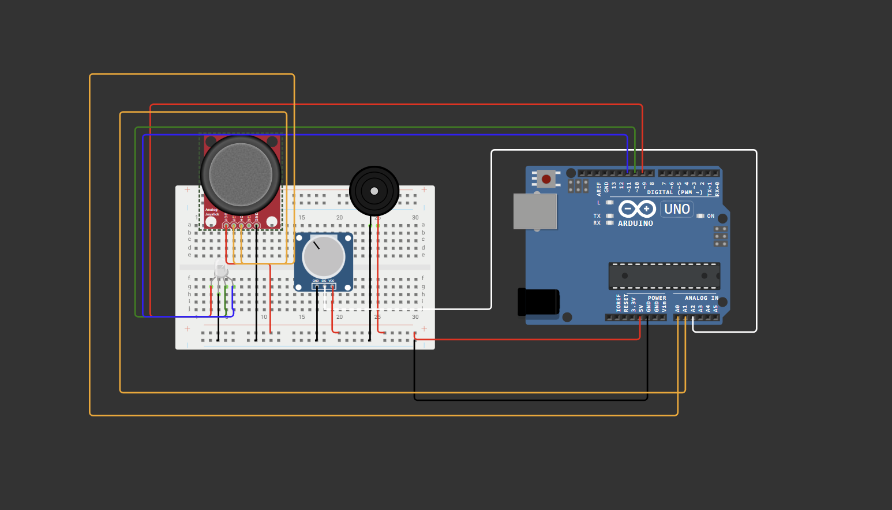

# Joystick and Potentiometer Controlled LED and Buzzer System

## Overview

This project uses an Arduino Uno to control an LED and a buzzer based on input from a joystick module and a potentiometer. The joystick determines LED color and buzzer activation, while the potentiometer adjusts the buzzer's frequency.

## Components Used

- **Arduino Uno**
- **Joystick module**
- **Potentiometer**
- **RGB LED** (or separate Red, Green, and Blue LEDs)
- **Buzzer**
- **Breadboard and jumper wires**

## Circuit Diagram

## How It Works

- The joystick's **X and Y axes** control LED colors based on movement direction.
- The **potentiometer** adjusts the buzzer's tone.
- The **buzzer** activates when the joystick is moved in any direction.
- The **RGB LED** lights up in different colors corresponding to joystick movements.
- The **Serial Monitor** displays the X, Y, and potentiometer values.

## How to Use

1. **Connect** the components as shown in the circuit diagram.
2. **Upload** the Arduino code to the board.
3. **Move** the joystick to observe LED color changes and buzzer activation.
4. **Turn** the potentiometer to adjust the buzzer's frequency.
5. **Monitor** the values in the Arduino Serial Monitor.

## Applications

- 🎮 **Interactive controls** for DIY projects.
- 🕹 **Game controller prototypes.**
- 🔊 **Sensor-based feedback systems.**

## Notes

- ⚡ Ensure **correct wiring** to prevent component damage.
- 💡 Modify **LED brightness** using PWM if necessary.
- 🎚 Experiment with different **mapping values** for customized responses.
